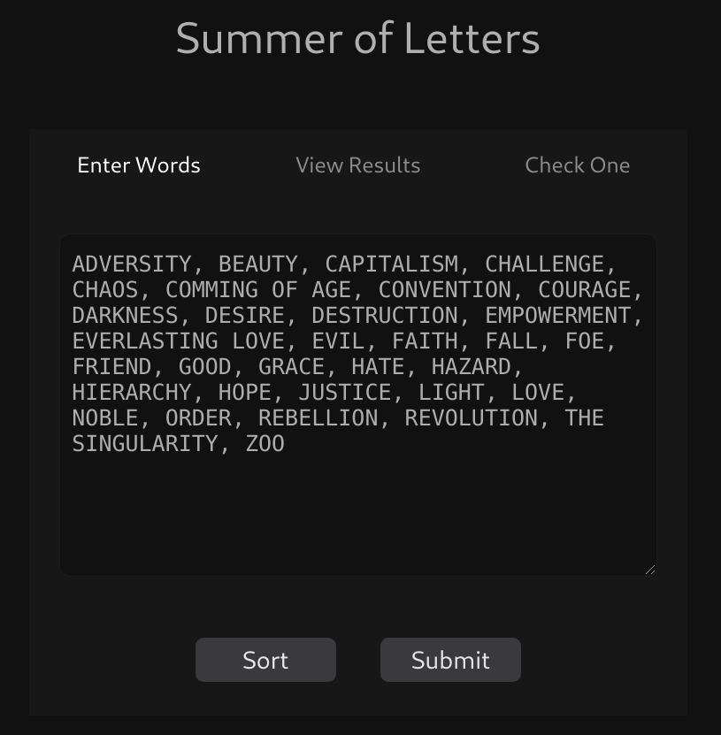
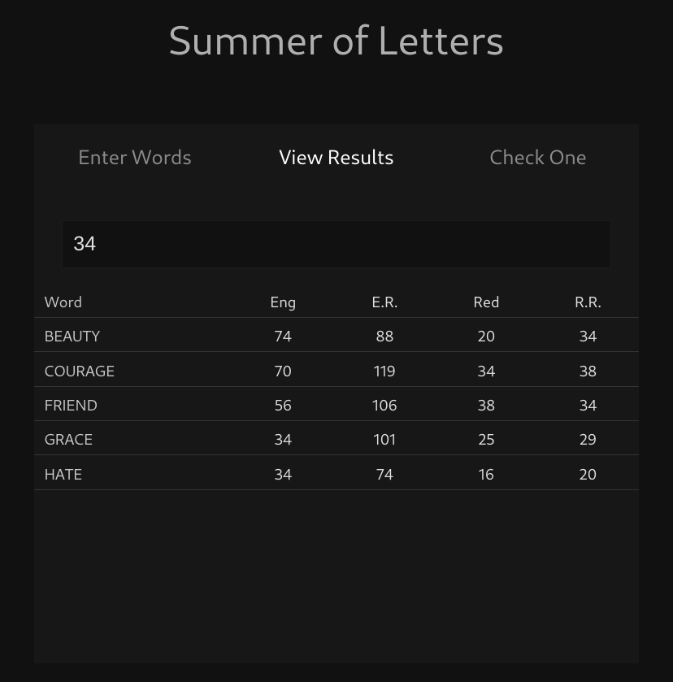

# summer of letters

A tool for summing letters.

## Usage

On the entry screen, enter a list of words to be summed.



Click on the results tab to see their sums and filter by number.



## API

Letters are calculated by summing the letters of words backwards and forwards.

```
const letterSummerCore = (word) => ({
  english: calculateOrdinal({ word, key: english }),
  englishReversed: calculateOrdinal({ word, key: englishReversed }),
  reduction: calculateReduction({ word, key: english }),
  reductionReversed: calculateReduction({ word, key: englishReversed }),
});

```

## Demo

Summer of Letters can be seen in the wild at: https://stringtalk.org/summer-of-letters

## Installation

-   git clone
-   npm install
-   npm start

## Building

-   npm run build

## Testing

-   npm run test
